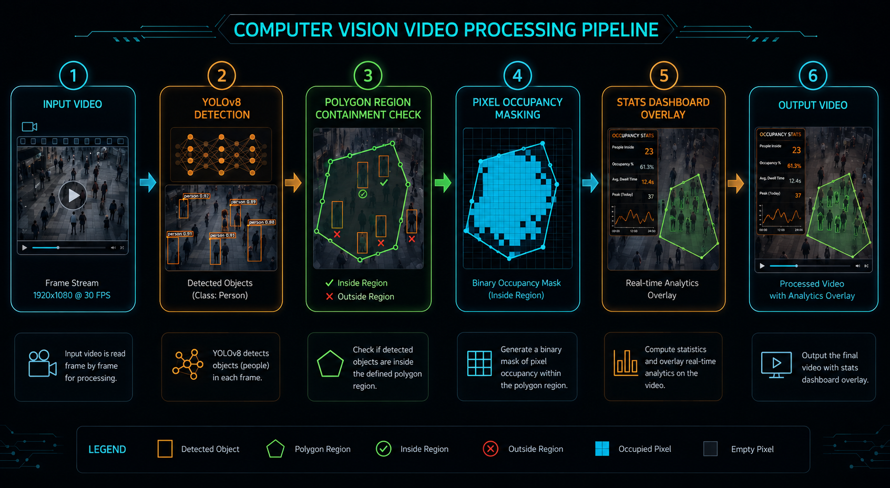
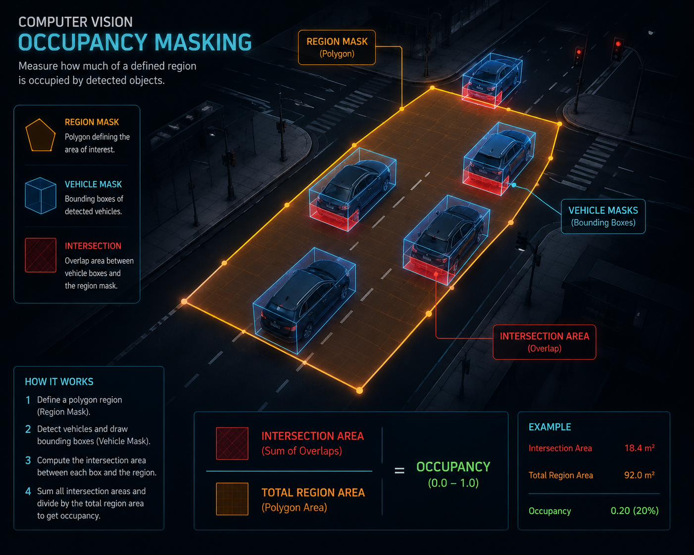
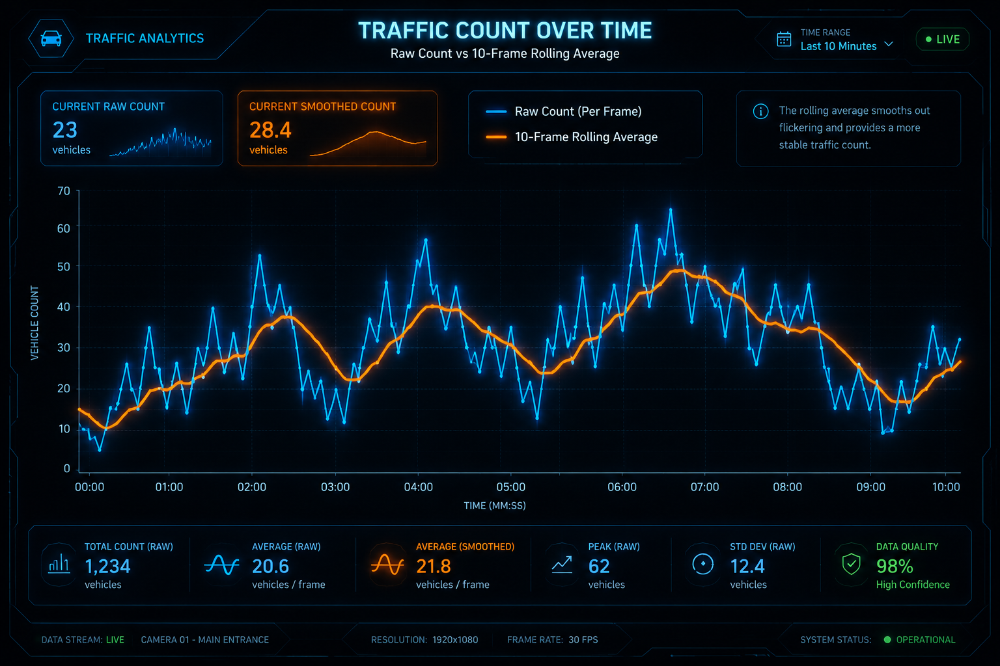

# 🚦 Real-Time Traffic Congestion Analyzer & Dashboard

A professional computer vision pipeline using **YOLOv8** and **OpenCV** to monitor regional road congestion. This project solves key real-world challenges in traffic monitoring by combining **pixel-occupancy masking** (measuring physical road area occupied, not just vehicle counts) and **temporal smoothing** (preventing state flickering from tracking noise). It also features an **interactive GUI region drawer** directly from the CLI.

---

## 🎯 The Problem & Our Solution

### 1. The Count vs. Space Dilemma
*   **The Problem:** Traditional detectors count vehicles. However, a truck occupies significantly more physical space than a motorcycle. If a region has 3 trucks, it might be heavily congested, while 3 motorcycles leave the lane free. Simple counts fail to capture true traffic volume.
*   **The Solution:** **Pixel-Occupancy Masking**. The system draws binary masks for the target regions and the detected vehicles, then computes their intersection. Congestion is determined by the percentage of physical road area occupied.

### 2. Detection Noise & State Flickering
*   **The Problem:** Raw frame-by-frame object detection is noisy. Occasional occlusions or brief misclassifications make region metrics jump erratically, causing visual indicators (Green/Orange/Red) to flicker rapidly.
*   **The Solution:** **Temporal Smoothing Buffers**. Metrics (counts, occupancies, classification percentages) are fed through sliding-window deque filters (default size: 10 frames). The resulting rolling averages ensure smooth status transitions.

### 3. Setup Complexity (JSON Coordinates)
*   **The Problem:** Defining coordinates for region polygons manually in JSON files is slow and tedious.
*   **The Solution:** **Interactive Region Drawer**. Launch the script with the `--draw` flag, click to place vertices on the video's first frame, and immediately run the analysis. You can also save these drawn regions to a JSON configuration file for reuse.

---

## 🚀 Key Features

*   **YOLOv8 Detection & Classification:** Tracks cars, trucks, buses, motorcycles (2-wheelers), auto-rickshaws (3-wheelers), and bicycles with unique color coding.
*   **Multi-Region Monitoring:** Supports an arbitrary number of custom-drawn regions of interest (ROIs).
*   **Live Analytics Dashboard:** Renders side-by-side with the input video, featuring:
    *   **Total Volume Histogram:** Color-coded volume bars for each region.
    *   **Regional Breakdown:** Dynamic pie-charts showing vehicle class distributions.
    *   **Rolling Stats List:** Text summary of vehicles currently inside each region.
*   **Robust Video Output:** Dumps processed video to standard `.avi` format using the `MJPG` codec to prevent file corruption across different platforms and OS versions.

---

## 🛠️ Installation

1.  **Clone the Repository:**
    ```bash
    git clone https://github.com/tejus09/traffic-congestion-analyzer.git
    cd traffic-congestion-analyzer
    ```

2.  **Create and Activate a Virtual Environment:**
    ```bash
    python3 -m venv venv
    source venv/bin/activate  # On Windows: venv\Scripts\activate
    ```

3.  **Install Dependencies:**
    ```bash
    pip install -r requirements.txt
    ```

---

## 💻 Usage

The analyzer supports three distinct modes of operation.

### 1. Default Mode (Quick Start)
Runs the analysis on `sample_traffic.mp4` using pre-configured coordinates for the lane layout:
```bash
python traffic_congestion_analyzer.py --source sample_traffic.mp4
```

### 2. Interactive Drawing Mode (Custom Video)
Draw your own custom lanes or monitoring zones interactively on any traffic video:
```bash
python traffic_congestion_analyzer.py --source sample_traffic.mp4 --draw
```
*   **Left-Click:** Place polygon vertices on the video frame.
*   **`n` Key:** Save current region and begin drawing the next region.
*   **`c` Key:** Clear vertices of the current active region.
*   **`s` Key:** Finalize all regions and start video processing.
*   **`q` Key:** Quit.

*Tip: Add `--save-config custom_regions.json` to save your hand-drawn regions to a configuration file.*

### 3. Config-Based Mode
Load pre-drawn regions from a JSON config file:
```bash
python traffic_congestion_analyzer.py --source sample_traffic.mp4 --config regions_config.json
```

---

## ⚙️ Configuration Arguments

| Argument | Type | Default | Description |
| :--- | :--- | :--- | :--- |
| `--source` | `str` | *Required* | Path to the input video |
| `--config` | `str` | `None` | Path to JSON regions configuration |
| `--draw` | `flag` | `False` | Launch interactive region drawing GUI |
| `--save-config` | `str` | `None` | Save drawn regions to specified JSON path |
| `--output` | `str` | `final_output.avi` | Output video path (uses robust MJPG codec) |
| `--weights` | `str` | `yolov8x.pt` | Path to YOLO model weights |
| `--conf` | `float` | `0.3` | Detection confidence threshold |
| `--min-count` | `int` | `5` | Min vehicle count to evaluate congestion status |
| `--congestion-ratio` | `float` | `0.70` | Occupancy ratio threshold (0.0 to 1.0) |

---

## 🎨 Visualizations & System Logic

### 1. System Logic & Pipeline Flowchart
Summarizes the frame-by-frame data flow of the computer vision pipeline, from raw video decoding through YOLOv8 object detection, geometric analysis, stats smoothing, and visual compositing.

<p align="center">
  
</p>

### 2. Pixel-Occupancy Masking Conceptual Diagram
Illustrates how the volumetric occupancy ratio is calculated by taking the pixel intersection area of the detected vehicle bounding boxes and the region's boundary mask.

<p align="center">
  
</p>

### 3. Temporal Smoothing (Moving Average) Graph
Demonstrates how the sliding-window buffer filters out high-frequency noise and occlusion gaps, ensuring stable state transitions for color-coded regions.

<p align="center">
  
</p>

---

## 📄 License
This project is licensed under the MIT License - see the [LICENSE](LICENSE) file for details.
